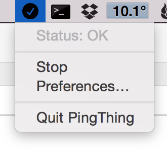

PingThing
=========

A little Mac app that sits in your menu bar and pings things.  It does not do very much else.  You get continuous feedback about the results.  The status icon changes depending on the results of the pings.

Known Issues
------------

* The 'Launch at Login' checkbox is not implemented - you will have to add it to your Login Items in System Preferences manually.
* No icon for the app...

Future Plans
------------

Here are the things I will be implementing next:

* Launch at Login
* Displaying the delay in the menu (and maybe even next to the icon)
* Suggestions of targets to Ping
* Multiple targets
* A cool graph of the delay over time
* Number of hops
